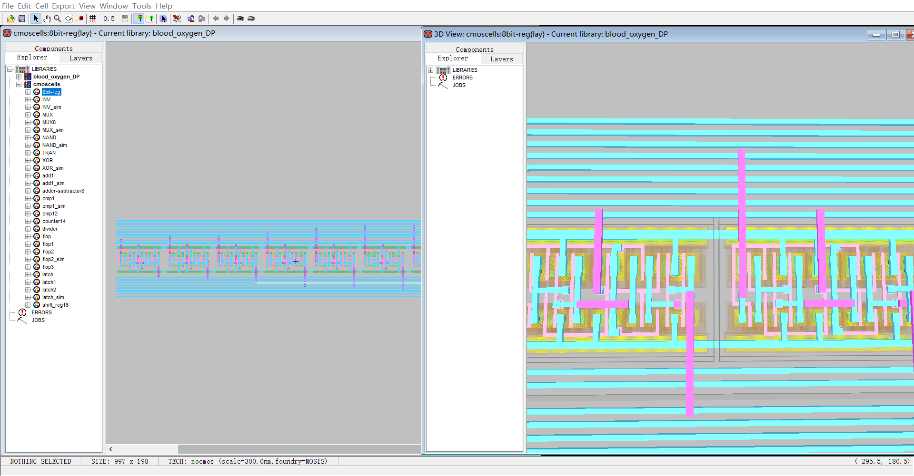
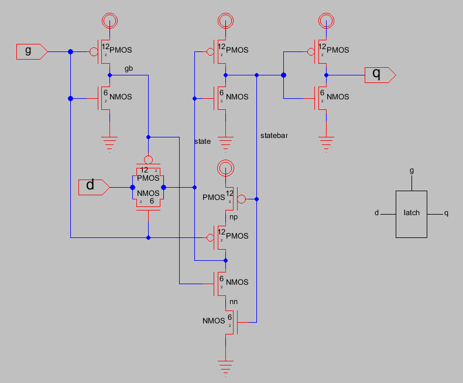
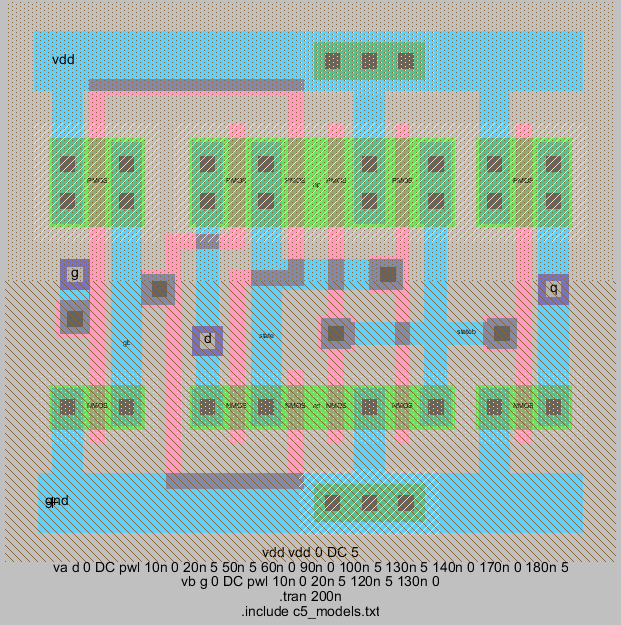
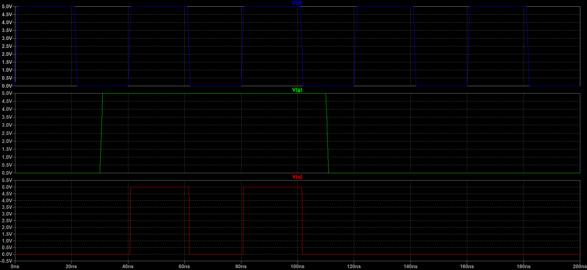
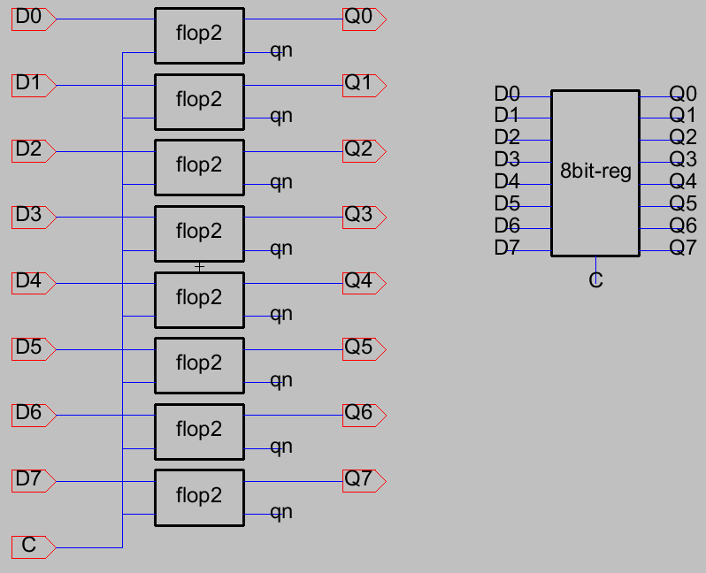
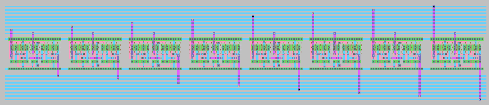
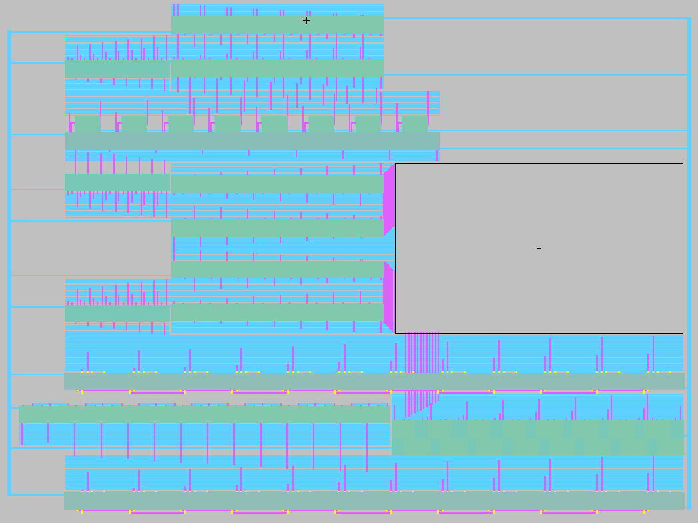

**English | [简体中文](README_cn.md)**
<div id="top"></div>

[![Contributors][contributors-shield]][contributors-url]
[![Forks][forks-shield]][forks-url]
[![Stargazers][stars-shield]][stars-url]
[![Issues][issues-shield]][issues-url]
[![License][license-shield]][license-url]


<!-- PROJECT LOGO -->
<br />
<div align="center">
    <a href="https://github.com/MoonGrt/Electric_VLSI_Pro">
    
    </a>
<h3 align="center">Electric_VLSI_Pro</h3>
    <p align="center">
    This repository contains projects and libraries designed in Electric VLSI. It includes a custom library with essential components and modular blocks for VLSI design, along with two main projects: CPU and Blood Oxygen (digital portion). The custom library comprises basic gates and functional blocks, while the main projects utilize these components to build more complex digital systems.
    <br />
    <a href="https://github.com/MoonGrt/Electric_VLSI_Pro"><strong>Explore the docs »</strong></a>
    <br />
    <a href="https://github.com/MoonGrt/Electric_VLSI_Pro">View Demo</a>
    ·
    <a href="https://github.com/MoonGrt/Electric_VLSI_Pro/issues">Report Bug</a>
    ·
    <a href="https://github.com/MoonGrt/Electric_VLSI_Pro/issues">Request Feature</a>
    </p>
</div>


<!-- CONTENTS -->
<details open>
  <summary>Contents</summary>
  <ol>
    <li><a href="#file-tree">File Tree</a></li>
    <li>
      <a href="#about-the-project">About The Project</a>
      <ul>
      </ul>
    </li>
    <li><a href="#contributing">Contributing</a></li>
    <li><a href="#license">License</a></li>
    <li><a href="#contact">Contact</a></li>
    <li><a href="#acknowledgments">Acknowledgments</a></li>
  </ol>
</details>


<!-- FILE TREE -->
## File Tree

```
└─ Project
  ├─ LICENSE
  ├─ README.md
  ├─ README_cn.md
  ├─ /Project/
  │ ├─ /Blood_Oxygen/
  │ │ ├─ Blood_Oxygen_DP.jelib
  │ │ ├─ Blood_Oxygen_DP.png
  │ │ ├─ /VHDL/
  │ │ └─ /Verilog/
  │ └─ /CPU/
  │   ├─ CPU.jelib
  │   └─ /Verilog/
  ├─ /Document/
  ├─ /Libs/
  │ └─ cmoscells.jelib
  └─ /Software/
    ├─ Electric_VLSI.txt
    ├─ run.bat
    └─ C5_models.txt

```


<!-- ABOUT THE PROJECT -->
## About The Project

<p align="center" style=" margin-top:0px; margin-bottom:0px; margin-left:0px; margin-right:0px; -qt-block-indent:0; text-indent:0px;"></p>
<p style="-qt-paragraph-type:empty; margin-top:0px; margin-bottom:0px; margin-left:0px; margin-right:0px; -qt-block-indent:0; text-indent:0px;"><br /></p>
<p style=" margin-top:12px; margin-bottom:12px; margin-left:0px; margin-right:0px; -qt-block-indent:0; text-indent:0px;"><span style=" font-size:12pt; font-weight:600;">Library (lib)</span> </p>
<p style=" margin-top:12px; margin-bottom:12px; margin-left:0px; margin-right:0px; -qt-block-indent:0; text-indent:0px;"><span style=" font-weight:600;">- basic:</span> Contains commonly used basic digital circuit components, which serve as foundational building blocks for more complex circuit modules. These core components cover essential logical operations and can be flexibly utilized within complex modules. Components include: </p>
<p style=" margin-top:12px; margin-bottom:12px; margin-left:0px; margin-right:0px; -qt-block-indent:0; text-indent:0px;">  - INV </p>
<p style=" margin-top:12px; margin-bottom:12px; margin-left:0px; margin-right:0px; -qt-block-indent:0; text-indent:0px;">  - MUX </p>
<p style=" margin-top:12px; margin-bottom:12px; margin-left:0px; margin-right:0px; -qt-block-indent:0; text-indent:0px;">  - TRAN </p>
<p style=" margin-top:12px; margin-bottom:12px; margin-left:0px; margin-right:0px; -qt-block-indent:0; text-indent:0px;">  - XOR </p>
<p style=" margin-top:12px; margin-bottom:12px; margin-left:0px; margin-right:0px; -qt-block-indent:0; text-indent:0px;">  - NAND </p>
<p style=" margin-top:12px; margin-bottom:12px; margin-left:0px; margin-right:0px; -qt-block-indent:0; text-indent:0px;">  - CMP </p>
<p style=" margin-top:12px; margin-bottom:12px; margin-left:0px; margin-right:0px; -qt-block-indent:0; text-indent:0px;">  - Latch </p>
<p style=" margin-top:12px; margin-bottom:12px; margin-left:0px; margin-right:0px; -qt-block-indent:0; text-indent:0px;">  - Flop </p>
<p align="center" style=" margin-top:0px; margin-bottom:0px; margin-left:0px; margin-right:0px; -qt-block-indent:0; text-indent:0px;"></p>
<p align="center" style=" margin-top:0px; margin-bottom:0px; margin-left:0px; margin-right:0px; -qt-block-indent:0; text-indent:0px;"></p>
<p align="center" style=" margin-top:0px; margin-bottom:0px; margin-left:0px; margin-right:0px; -qt-block-indent:0; text-indent:0px;"></p>
<p align="center" style=" margin-top:0px; margin-bottom:0px; margin-left:0px; margin-right:0px; -qt-block-indent:0; text-indent:0px;">(The sch, layout, sim of Latch,etc.)</p>
<p style="-qt-paragraph-type:empty; margin-top:12px; margin-bottom:12px; margin-left:0px; margin-right:0px; -qt-block-indent:0; text-indent:0px;"><br /></p>
<p style=" margin-top:12px; margin-bottom:12px; margin-left:0px; margin-right:0px; -qt-block-indent:0; text-indent:0px;"><span style=" font-weight:600;">- module:</span> This sub-library includes various small-scale module designs capable of performing more complex digital operations and data processing. These modules can be directly used as functional components in system design, enhancing design reusability and efficiency. Modules include: </p>
<p style=" margin-top:12px; margin-bottom:12px; margin-left:0px; margin-right:0px; -qt-block-indent:0; text-indent:0px;">  - 8bit-reg: 8-bit register </p>
<p style=" margin-top:12px; margin-bottom:12px; margin-left:0px; margin-right:0px; -qt-block-indent:0; text-indent:0px;">  - MUX8: 8-to-1 multiplexer </p>
<p style=" margin-top:12px; margin-bottom:12px; margin-left:0px; margin-right:0px; -qt-block-indent:0; text-indent:0px;">  - add1: 1-bit adder </p>
<p style=" margin-top:12px; margin-bottom:12px; margin-left:0px; margin-right:0px; -qt-block-indent:0; text-indent:0px;">  - adder-subtractor8: 8-bit adder/subtractor </p>
<p style=" margin-top:12px; margin-bottom:12px; margin-left:0px; margin-right:0px; -qt-block-indent:0; text-indent:0px;">  - cmp12: 12-bit comparator </p>
<p style=" margin-top:12px; margin-bottom:12px; margin-left:0px; margin-right:0px; -qt-block-indent:0; text-indent:0px;">  - counter14: 14-bit counter </p>
<p style=" margin-top:12px; margin-bottom:12px; margin-left:0px; margin-right:0px; -qt-block-indent:0; text-indent:0px;">  - shift_reg16: 16-bit shift register</p>
<p align="center" style=" margin-top:0px; margin-bottom:0px; margin-left:0px; margin-right:0px; -qt-block-indent:0; text-indent:0px;"></p>
<p align="center" style=" margin-top:0px; margin-bottom:0px; margin-left:0px; margin-right:0px; -qt-block-indent:0; text-indent:0px;"></p>
<p align="center" style=" margin-top:0px; margin-bottom:0px; margin-left:0px; margin-right:0px; -qt-block-indent:0; text-indent:0px;">(The sch, layout of 8bit-reg,etc.)</p>
<p style="-qt-paragraph-type:empty; margin-top:0px; margin-bottom:0px; margin-left:0px; margin-right:0px; -qt-block-indent:0; text-indent:0px;"><br /></p>
<p style="-qt-paragraph-type:empty; margin-top:12px; margin-bottom:12px; margin-left:0px; margin-right:0px; -qt-block-indent:0; text-indent:0px;"><br /></p>
<p style=" margin-top:12px; margin-bottom:12px; margin-left:0px; margin-right:0px; -qt-block-indent:0; text-indent:0px;"><span style=" font-size:12pt; font-weight:600;">Projects</span> </p>
<p style=" margin-top:12px; margin-bottom:12px; margin-left:0px; margin-right:0px; -qt-block-indent:0; text-indent:0px;"><span style=" font-weight:600;">- CPU: </span>A central processing unit design built using the custom library, adopting a modular structure. It combines basic components and modules from the custom library to form core elements like the processing unit, arithmetic logic unit (ALU), control unit, and register file. The project provides Verilog source code, detailing data pathways, control signals, and register controls, offering a comprehensive CPU design example. </p>
<p style=" margin-top:12px; margin-bottom:12px; margin-left:0px; margin-right:0px; -qt-block-indent:0; text-indent:0px;"><span style=" font-weight:600;">- Blood_Oxygen_DP:</span> Digital logic design for the blood oxygen measurement circuit, implemented using modules from the library. This project focuses on data processing within the blood oxygen measurement system. It includes source code written in VHDL and Verilog, implementing data processing logic, conditional checks, and counter functionalities, making it suitable for digital logic applications in biomedical measurement systems. </p>
<p align="center" style=" margin-top:0px; margin-bottom:0px; margin-left:0px; margin-right:0px; -qt-block-indent:0; text-indent:0px;"></p></body></html>
<p align="right">(<a href="#top">top</a>)</p>


<!-- CONTRIBUTING -->
## Contributing

Contributions are what make the open source community such an amazing place to learn, inspire, and create. Any contributions you make are **greatly appreciated**.
If you have a suggestion that would make this better, please fork the repo and create a pull request. You can also simply open an issue with the tag "enhancement".
Don't forget to give the project a star! Thanks again!
1. Fork the Project
2. Create your Feature Branch (`git checkout -b feature/AmazingFeature`)
3. Commit your Changes (`git commit -m 'Add some AmazingFeature'`)
4. Push to the Branch (`git push origin feature/AmazingFeature`)
5. Open a Pull Request
<p align="right">(<a href="#top">top</a>)</p>


<!-- LICENSE -->
## License

Distributed under the MIT License. See `LICENSE` for more information.
<p align="right">(<a href="#top">top</a>)</p>


<!-- CONTACT -->
## Contact

MoonGrt - 1561145394@qq.com
Project Link: [MoonGrt/Electric_VLSI_Pro](https://github.com/MoonGrt/Electric_VLSI_Pro)
<p align="right">(<a href="#top">top</a>)</p>


<!-- ACKNOWLEDGMENTS -->
## Acknowledgments

* [Choose an Open Source License](https://choosealicense.com)
* [GitHub Emoji Cheat Sheet](https://www.webpagefx.com/tools/emoji-cheat-sheet)
* [Malven's Flexbox Cheatsheet](https://flexbox.malven.co/)
* [Malven's Grid Cheatsheet](https://grid.malven.co/)
* [Img Shields](https://shields.io)
* [GitHub Pages](https://pages.github.com)
* [Font Awesome](https://fontawesome.com)
* [React Icons](https://react-icons.github.io/react-icons/search)
<p align="right">(<a href="#top">top</a>)</p>


<!-- MARKDOWN LINKS & IMAGES -->
<!-- https://www.markdownguide.org/basic-syntax/#reference-style-links -->
[contributors-shield]: https://img.shields.io/github/contributors/MoonGrt/Electric_VLSI_Pro.svg?style=for-the-badge
[contributors-url]: https://github.com/MoonGrt/Electric_VLSI_Pro/graphs/contributors
[forks-shield]: https://img.shields.io/github/forks/MoonGrt/Electric_VLSI_Pro.svg?style=for-the-badge
[forks-url]: https://github.com/MoonGrt/Electric_VLSI_Pro/network/members
[stars-shield]: https://img.shields.io/github/stars/MoonGrt/Electric_VLSI_Pro.svg?style=for-the-badge
[stars-url]: https://github.com/MoonGrt/Electric_VLSI_Pro/stargazers
[issues-shield]: https://img.shields.io/github/issues/MoonGrt/Electric_VLSI_Pro.svg?style=for-the-badge
[issues-url]: https://github.com/MoonGrt/Electric_VLSI_Pro/issues
[license-shield]: https://img.shields.io/github/license/MoonGrt/Electric_VLSI_Pro.svg?style=for-the-badge
[license-url]: https://github.com/MoonGrt/Electric_VLSI_Pro/blob/master/LICENSE

