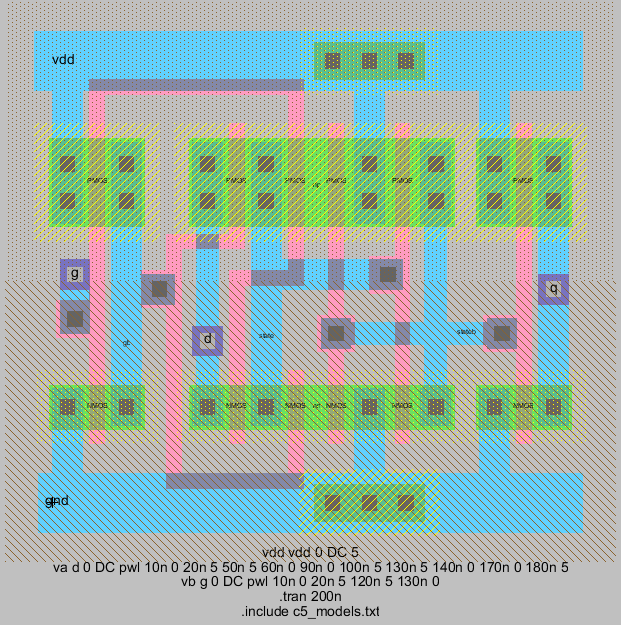
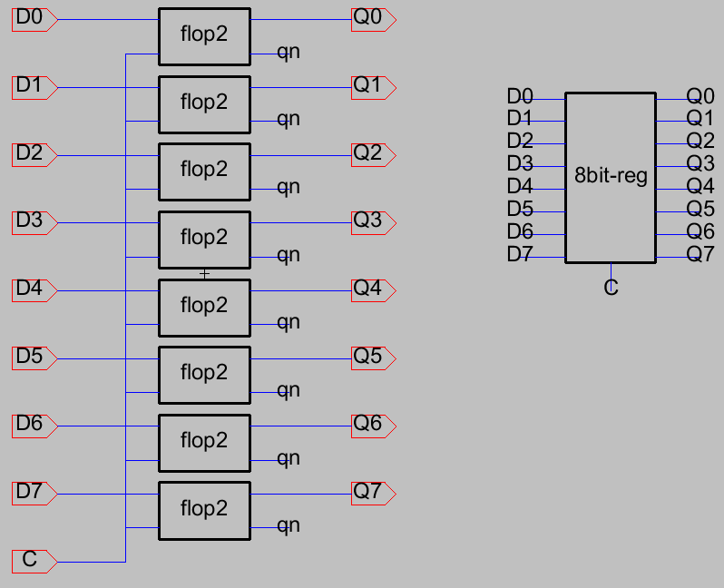
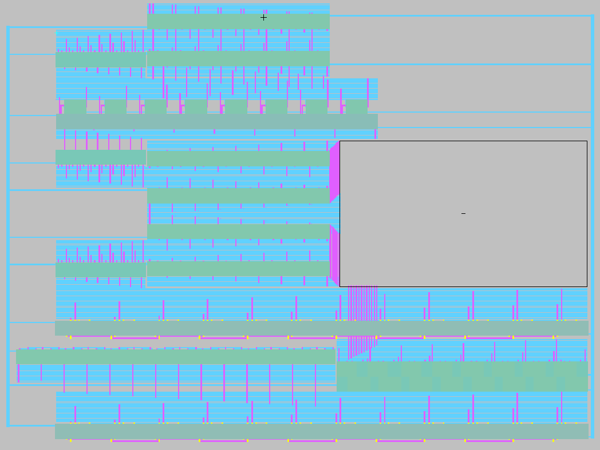

**简体中文 | [English](README.md)**
<div id="top"></div>

[![Contributors][contributors-shield]][contributors-url]
[![Forks][forks-shield]][forks-url]
[![Stargazers][stars-shield]][stars-url]
[![Issues][issues-shield]][issues-url]
[![License][license-shield]][license-url]


<!-- PROJECT LOGO -->
<br />
<div align="center">
    <a href="https://github.com/MoonGrt/Electric_VLSI_Pro">
    
    </a>
<h3 align="center">Electric_VLSI_Pro</h3>
    <p align="center">
    此仓库存放了基于 Electric VLSI 设计的软件项目和自定义库，包括基本器件和小型模块的自定义库，以及两个主要项目：CPU 和血氧（数字部分）。自定义库包含基本门电路和功能模块，主项目则基于这些组件构建了复杂的数字系统。
    <br />
    <a href="https://github.com/MoonGrt/Electric_VLSI_Pro"><strong>浏览文档 »</strong></a>
    <br />
    <a href="https://github.com/MoonGrt/Electric_VLSI_Pro">查看 Demo</a>
    ·
    <a href="https://github.com/MoonGrt/Electric_VLSI_Pro/issues">反馈 Bug</a>
    ·
    <a href="https://github.com/MoonGrt/Electric_VLSI_Pro/issues">请求新功能</a>
    </p>
</div>


<!-- CONTENTS -->
<details open>
  <summary>目录</summary>
  <ol>
    <li><a href="#文件树">文件树</a></li>
    <li>
      <a href="#关于本项目">关于本项目</a>
      <ul>
      </ul>
    </li>
    <li><a href="#贡献">贡献</a></li>
    <li><a href="#许可证">许可证</a></li>
    <li><a href="#联系我们">联系我们</a></li>
    <li><a href="#致谢">致谢</a></li>
  </ol>
</details>


<!-- 文件树 -->
## 文件树

```
└─ Project
  ├─ LICENSE
  ├─ README.md
  ├─ README_cn.md
  ├─ /Project/
  │ ├─ /Blood_Oxygen/
  │ │ ├─ Blood_Oxygen_DP.jelib
  │ │ ├─ Blood_Oxygen_DP.png
  │ │ ├─ /VHDL/
  │ │ └─ /Verilog/
  │ └─ /CPU/
  │   ├─ CPU.jelib
  │   └─ /Verilog/
  ├─ /Document/
  ├─ /Libs/
  │ └─ cmoscells.jelib
  └─ /Software/
    ├─ Electric_VLSI.txt
    ├─ run.bat
    └─ C5_models.txt
```


<!-- 关于本项目 -->
## 关于本项目

<p align="center" style=" margin-top:0px; margin-bottom:0px; margin-left:0px; margin-right:0px; -qt-block-indent:0; text-indent:0px;"></p>
<p style="-qt-paragraph-type:empty; margin-top:0px; margin-bottom:0px; margin-left:0px; margin-right:0px; -qt-block-indent:0; text-indent:0px;"><br /></p>
<p style=" margin-top:0px; margin-bottom:0px; margin-left:0px; margin-right:0px; -qt-block-indent:0; text-indent:0px;"><span style=" font-size:12pt; font-weight:600;">库（lib）</span> </p>
<p style=" margin-top:12px; margin-bottom:12px; margin-left:0px; margin-right:0px; -qt-block-indent:0; text-indent:0px;">  <span style=" font-weight:600;">- basic</span>： 包含常用的数字电路基础器件，是构建更复杂电路模块的基础组件。这些基本器件涵盖了逻辑运算的核心功能，便于在复杂模块中灵活调用，具体包括： </p>
<p style=" margin-top:12px; margin-bottom:12px; margin-left:0px; margin-right:0px; -qt-block-indent:0; text-indent:0px;">  - INV </p>
<p style=" margin-top:12px; margin-bottom:12px; margin-left:0px; margin-right:0px; -qt-block-indent:0; text-indent:0px;">  - MUX </p>
<p style=" margin-top:12px; margin-bottom:12px; margin-left:0px; margin-right:0px; -qt-block-indent:0; text-indent:0px;">  - TRAN </p>
<p style=" margin-top:12px; margin-bottom:12px; margin-left:0px; margin-right:0px; -qt-block-indent:0; text-indent:0px;">  - XOR </p>
<p style=" margin-top:12px; margin-bottom:12px; margin-left:0px; margin-right:0px; -qt-block-indent:0; text-indent:0px;">  - NAND </p>
<p style=" margin-top:12px; margin-bottom:12px; margin-left:0px; margin-right:0px; -qt-block-indent:0; text-indent:0px;">  - CMP </p>
<p style=" margin-top:12px; margin-bottom:12px; margin-left:0px; margin-right:0px; -qt-block-indent:0; text-indent:0px;">  - Latch </p>
<p style=" margin-top:12px; margin-bottom:12px; margin-left:0px; margin-right:0px; -qt-block-indent:0; text-indent:0px;">  - Flop </p>
<p style="-qt-paragraph-type:empty; margin-top:12px; margin-bottom:12px; margin-left:0px; margin-right:0px; -qt-block-indent:0; text-indent:0px;"><br /></p>
<p align="center" style=" margin-top:0px; margin-bottom:0px; margin-left:0px; margin-right:0px; -qt-block-indent:0; text-indent:0px;"></p>
<p align="center" style=" margin-top:0px; margin-bottom:0px; margin-left:0px; margin-right:0px; -qt-block-indent:0; text-indent:0px;"></p>
<p align="center" style=" margin-top:0px; margin-bottom:0px; margin-left:0px; margin-right:0px; -qt-block-indent:0; text-indent:0px;"></p>
<p align="center" style=" margin-top:0px; margin-bottom:0px; margin-left:0px; margin-right:0px; -qt-block-indent:0; text-indent:0px;">(Latch的原理图、版图、仿真)</p>
<p style="-qt-paragraph-type:empty; margin-top:12px; margin-bottom:12px; margin-left:0px; margin-right:0px; -qt-block-indent:0; text-indent:0px;"><br /></p>
<p style=" margin-top:12px; margin-bottom:12px; margin-left:0px; margin-right:0px; -qt-block-indent:0; text-indent:0px;"> <span style=" font-weight:600;"> -module</span>：此子库包含多种小型模块设计，能够完成较为复杂的数字运算和数据处理。这些模块可以直接作为系统设计的功能模块，提高设计复用性和设计效率。具体包括： </p>
<p style=" margin-top:12px; margin-bottom:12px; margin-left:0px; margin-right:0px; -qt-block-indent:0; text-indent:0px;">  - 8bit-reg：8 位寄存器 </p>
<p style=" margin-top:12px; margin-bottom:12px; margin-left:0px; margin-right:0px; -qt-block-indent:0; text-indent:0px;">  - MUX8：8 路选择器 </p>
<p style=" margin-top:12px; margin-bottom:12px; margin-left:0px; margin-right:0px; -qt-block-indent:0; text-indent:0px;">  - add1：1 位加法器 </p>
<p style=" margin-top:12px; margin-bottom:12px; margin-left:0px; margin-right:0px; -qt-block-indent:0; text-indent:0px;">  - adder-subtractor8（8 位加/减法器 </p>
<p style=" margin-top:12px; margin-bottom:12px; margin-left:0px; margin-right:0px; -qt-block-indent:0; text-indent:0px;">  - cmp12：12 位比较器 </p>
<p style=" margin-top:12px; margin-bottom:12px; margin-left:0px; margin-right:0px; -qt-block-indent:0; text-indent:0px;">  - counter14：14 位计数器 </p>
<p style=" margin-top:12px; margin-bottom:12px; margin-left:0px; margin-right:0px; -qt-block-indent:0; text-indent:0px;">  - shift_reg16：16 位移位寄存器</p>
<p align="center" style=" margin-top:0px; margin-bottom:0px; margin-left:0px; margin-right:0px; -qt-block-indent:0; text-indent:0px;"></p>
<p align="center" style=" margin-top:0px; margin-bottom:0px; margin-left:0px; margin-right:0px; -qt-block-indent:0; text-indent:0px;"></p>
<p align="center" style=" margin-top:0px; margin-bottom:0px; margin-left:0px; margin-right:0px; -qt-block-indent:0; text-indent:0px;">(8bit-reg 的原理图和版图)</p>
<p style="-qt-paragraph-type:empty; margin-top:0px; margin-bottom:0px; margin-left:0px; margin-right:0px; -qt-block-indent:0; text-indent:0px;"><br /></p>
<p style=" margin-top:12px; margin-bottom:12px; margin-left:0px; margin-right:0px; -qt-block-indent:0; text-indent:0px;"><span style=" font-size:12pt; font-weight:600;">项目</span> </p>
<p style=" margin-top:12px; margin-bottom:12px; margin-left:0px; margin-right:0px; -qt-block-indent:0; text-indent:0px;">  <span style=" font-weight:600;">- CPU</span>：基于自定义库构建的中央处理器设计，采用模块化的结构，通过组合自定义库中的基础器件和模块，构成基本的处理单元、算术逻辑单元（ALU）、控制单元和寄存器堆等。项目提供了 Verilog 源码，设计了数据通路、控制信号以及寄存器控制等功能，提供完整的处理器设计实例。 </p>
<p style=" margin-top:12px; margin-bottom:12px; margin-left:0px; margin-right:0px; -qt-block-indent:0; text-indent:0px;"> <span style=" font-weight:600;"> - Blood_Oxygen_DP</span>：血氧测量电路的数字逻辑部分设计，该设计基于库中的模块进行实现。项目主要用于血氧测量系统中的数据处理，利用 VHDL 和 Verilog 编写的源码实现了数据处理逻辑、条件判断及计数器等功能模块。 </p>
<p align="center" style=" margin-top:0px; margin-bottom:0px; margin-left:0px; margin-right:0px; -qt-block-indent:0; text-indent:0px;"></p></body></html>
<p align="right">(<a href="#top">top</a>)</p>


<!-- 贡献 -->
## 贡献

贡献让开源社区成为了一个非常适合学习、互相激励和创新的地方。你所做出的任何贡献都是**受人尊敬**的。

如果你有好的建议，请复刻（fork）本仓库并且创建一个拉取请求（pull request）。你也可以简单地创建一个议题（issue），并且添加标签「enhancement」。不要忘记给项目点一个 star！再次感谢！

1. 复刻（Fork）本项目
2. 创建你的 Feature 分支 (`git checkout -b feature/AmazingFeature`)
3. 提交你的变更 (`git commit -m 'Add some AmazingFeature'`)
4. 推送到该分支 (`git push origin feature/AmazingFeature`)
5. 创建一个拉取请求（Pull Request）
<p align="right">(<a href="#top">top</a>)</p>


<!-- 许可证 -->
## 许可证

根据 MIT 许可证分发。打开 [LICENSE](LICENSE) 查看更多内容。
<p align="right">(<a href="#top">top</a>)</p>


<!-- 联系我们 -->
## 联系我们

MoonGrt - 1561145394@qq.com
Project Link: [MoonGrt/Electric_VLSI_Pro](https://github.com/MoonGrt/Electric_VLSI_Pro)
<p align="right">(<a href="#top">top</a>)</p>


<!-- 致谢 -->
## 致谢

在这里列出你觉得有用的资源，并以此致谢。我已经添加了一些我喜欢的资源，以便你可以快速开始！

* [Choose an Open Source License](https://choosealicense.com)
* [GitHub Emoji Cheat Sheet](https://www.webpagefx.com/tools/emoji-cheat-sheet)
* [Malven's Flexbox Cheatsheet](https://flexbox.malven.co/)
* [Malven's Grid Cheatsheet](https://grid.malven.co/)
* [Img Shields](https://shields.io)
* [GitHub Pages](https://pages.github.com)
* [Font Awesome](https://fontawesome.com)
* [React Icons](https://react-icons.github.io/react-icons/search)
<p align="right">(<a href="#top">top</a>)</p>


<!-- MARKDOWN LINKS & IMAGES -->
<!-- https://www.markdownguide.org/basic-syntax/#reference-style-links -->
[contributors-shield]: https://img.shields.io/github/contributors/MoonGrt/Electric_VLSI_Pro.svg?style=for-the-badge
[contributors-url]: https://github.com/MoonGrt/Electric_VLSI_Pro/graphs/contributors
[forks-shield]: https://img.shields.io/github/forks/MoonGrt/Electric_VLSI_Pro.svg?style=for-the-badge
[forks-url]: https://github.com/MoonGrt/Electric_VLSI_Pro/network/members
[stars-shield]: https://img.shields.io/github/stars/MoonGrt/Electric_VLSI_Pro.svg?style=for-the-badge
[stars-url]: https://github.com/MoonGrt/Electric_VLSI_Pro/stargazers
[issues-shield]: https://img.shields.io/github/issues/MoonGrt/Electric_VLSI_Pro.svg?style=for-the-badge
[issues-url]: https://github.com/MoonGrt/Electric_VLSI_Pro/issues
[license-shield]: https://img.shields.io/github/license/MoonGrt/Electric_VLSI_Pro.svg?style=for-the-badge
[license-url]: https://github.com/MoonGrt/Electric_VLSI_Pro/blob/master/LICENSE

